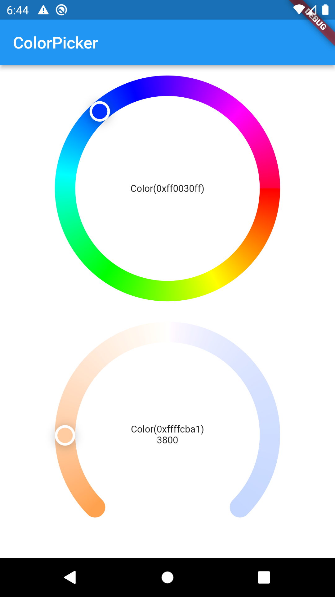

# dooz_color_picker

A Flutter package that provides widgets to enable a user to select a color and some other params of a RGB light using circular sliders.

## Getting Started
```dart
import 'package:dooz_color_picker/dooz_color_picker.dart';

CircleColorPicker(
  radius: 140,
  thumbRadius: 15,
  initialColor: Colors.red,
  child: Text(pickerColor?.toString() ?? ''),
  colorListener: (Color value) {
    setState(() {
      pickerColor = value;
    });
 },
)

CircleTemperaturePicker(
  radius: 140,
  thumbRadius: 15,
  initialTemperature: 2600,
  startTemperature: 2600,
  endTemperature: 10600,
  colorListener: (Color value, int kDegree) {
    setState(() {
      kelvinColor = value;
      kelvinValue = kDegree;
    });
  },
  child: Text(
    '${kelvinColor?.toString() ?? ''}\n'
    '${kelvinValue?.toString() ?? ''}',
    textAlign: TextAlign.center,
  ),
),
```

